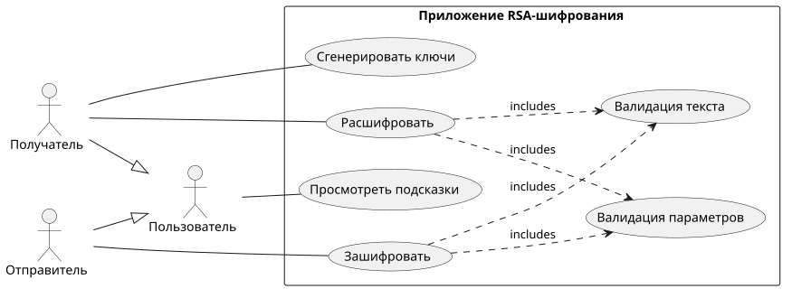
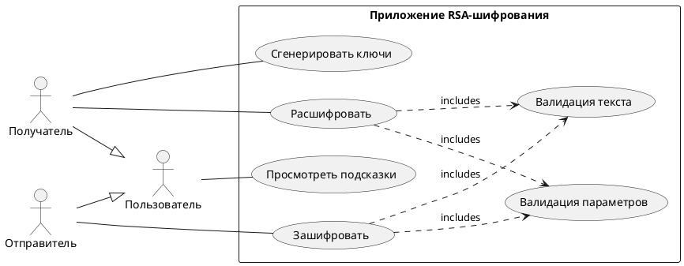
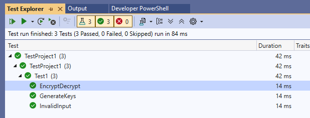

# Практическая 7, часть 2

Выполнили: Писарчук Б., Адарченко Е.

Вариант 7

## Анализ требований, оформления и предметной области

Задание требует:

1. Разработать диаграмму вариантов использования;
2. Разработать тестовые сценарии;
3. Разработать автоматизированные тесты на основе сценариев;
4. Разработать модули шифрования/дешифрования, разработать графическое приложение;
5. Провести отладку;
6. Провести автоматизированное тестирование;
7. Исправить баги (при наличии);
8. Провести ручное тестирование.

Предметной областью является RSA-шифрование и создание к нему интерфейса.

Так как RSA является асимметричным шифром, требуется добавить поддержку создания открытого ключа по закрытому.

Задание требует шифровать исходный текст посимвольно, а не применять функцию шифрования один раз ко всему входному тексту, так что задачу можно представить как создание функции, которая отображает нешифрованный код символа в шифрованный.

Изначально здесь был абзац длиною чуть больше тысячи символов, расписывающий, что можно сделать отображение не с фиксированными в программе алфавитами (латиница, кириллица, цифры...), а с большей частью используемого Unicode, но тот факт, что даже в BMP намешано в разных местах множество управляющих символов, которые не дают так легко строить валидные последовательности символов, вынуждает вернуться к банальной идее с предопределёнными алфавитами.

Так как при посимвольном шифровании шифрованный код символа может быть больше, чем может быть представлено в алфавите, каждый символ нешифрованного текста нужно отображать минимум на два символа.

Алгоритмы (не в общем виде, то, что можно было упростить ([https://en.wikipedia.org/wiki/RSA_cryptosystem#:~:text=The%20smallest%20%28and%20fastest%29%20possible%20value%20for%20e%20is%203](например)), упрощено):

### Генерация ключей

1. Выбрать два случайных простых числа p, q;
2. Вычислить n = p * q (n должен быть не короче, чем длина шифруемого сообщения) (так как в задании шифруются отдельные символы, добиться этого несложно);
3. Вычислить l = (p - 1) * (q - 1) / НОД(p - 1, q - 1);
4. Найти простое e, что не больше l и не является делителем l;
5. Найти d такое, что (d * e) % l == 1; (если бы алгоритм Евклида для нахождения НОД выше надо было бы реализовывать самим, то по пути можно было бы реализовать и расширенный алгоритм Евклида, с помощью которого можно эффективно и в общем виде найти d. Для простоты можно использовать перебор);
6. Итог: (e, n) -- публичный ключ, (d, n) -- приватный (на самом деле по одному только d вроде бы нельзя вывести публичный ключ, но можно расшифровывать зашифрованные сообщения. Для простоты будем говорит, что приватный ключ это только d и n).

### Шифрование

ШифрованныйТекст = (ИсходныйТекст ^ e) % n

### Дешифрование

ИсходныйТекст = (ШифрованныйТекст ^ d) % n

### Пример (вручную)

1. p = 5, q = 7 (выбрано);
2. n = 5 * 7 = 35;
3. l = 4 * 6 / НОД(4, 6) = 24 / 2 = 12;
4. e = 5;
5. e * d % 12 == 1 выполняется при d = 5.
6. ИсходныйТекст = 33;
7. ШифрованныйТекст = 33 ^ 5 % 35 = 39'135'393 % 35 = 3;
8. ИсходныйТекст = (3 ^ 5) % 35 = 243 % 35 = 33.

Оформление: весь код в папке проекта, весь текст в Readme, все картинки в файлах рядом.

Примечание: алфавит: 0123456789АБВГДЕЁЖЗИЙКЛМНОПРСТУФХЦЧШЩЪЫЬЭЮЯабвгдеёжзийклмнопрстуфхцчшщъыьэюя и пробел

(77 символов)

## Диаграмма вариантов использования

## Тест-кейсы

| Тестовый пример № | TC_01 |
| ---- | ---- |
| Приоритет тестирования | Высокий |
| Заголовок/название теста | Генерация ключей |
| Краткое изложение теста | Проверка генерации ключей |
| Этапы теста | 1. Нажать "Сгенерировать ключи". |
| Тестовые данные | Нет |
| Ожидаемый результат | В полях ввода параметров ключей появляются сгенерированные значения |
| Фактический результат | В полях ввода параметров ключей появляются сгенерированные значения |
| Статус | Корректно |
| Предварительное условие | Приложение запущено |
| Постусловие | В полях ввода параметров находятся сгенерированные значения. |
| Примечания/комментарии | Используются те же самые поля, в которые пользователь может ввести |

| Тестовый пример № | TC_02 |
| ---- | ---- |
| Приоритет тестирования | Высокий |
| Заголовок/название теста | Шифрование |
| Краткое изложение теста | Проверка шифрования |
| Этапы теста | 1. Нажать "Сгенерировать ключи"; 2. Ввести валидный текст; 3. Нажать "Зашифровать". |
| Тестовые данные | Текст: "я прогуливаю пары" |
| Ожидаемый результат | В поле вывода появляется зашифрованный текст |
| Фактический результат | В поле вывода появляется зашифрованный текст |
| Статус | Корректно |
| Предварительное условие | Приложение запущено |
| Постусловие | В поле вывода находится зашифрованный текст |
| Примечания/комментарии | Нет |

| Тестовый пример № | TC_03 |
| ---- | ---- |
| Приоритет тестирования | Высокий |
| Заголовок/название теста | Расшифрование |
| Краткое изложение теста | Проверка расшифрования |
| Этапы теста | 1. Ввести валидные для текста параметры приватного ключа; 2. Ввести валидный шифрованный текст; 3. Нажать "Расшифровать". |
| Тестовые данные | Вывод предыдущего тест-кейса |
| Ожидаемый результат | В поле вывода появляется расшифрованный текст |
| Фактический результат | В поле вывода появляется расшифрованный текст |
| Статус | Корректно |
| Предварительное условие | Приложение запущено |
| Постусловие | В поле вывода находится "я прогуливаю пары" |
| Примечания/комментарии | Нет |

| Тестовый пример № | TC_04 |
| ---- | ---- |
| Приоритет тестирования | Средний |
| Заголовок/название теста | Невалидные параметры |
| Краткое изложение теста | Проверка проверки невалидных параметров |
| Этапы теста | 1. Данные приватного ключа: d = 1, n = 1; 2. Ввести валидный шифрованный текст; 3. Нажать "Расшифровать". |
| Тестовые данные | d = 1, n = 1 |
| Ожидаемый результат | Появится ошибка |
| Фактический результат | Ошибка "невалидные параметры" |
| Статус | Корректно |
| Предварительное условие | Приложение запущено |
| Постусловие | Нет |
| Примечания/комментарии | В общем виде нельзя по параметрам точно определить, являются ли они валидными, остаётся проверять, что можем |

| Тестовый пример № | TC_05 |
| ---- | ---- |
| Приоритет тестирования | Средний |
| Заголовок/название теста | Невалидные параметры 2 |
| Краткое изложение теста | Проверка проверки невалидных параметров |
| Этапы теста | 1. Данные публичного ключа: e = 1337, n = 1; 2. Ввести валидный текст; 3. Нажать "Зашифровать". |
| Тестовые данные | e = 1337, n = 1 |
| Ожидаемый результат | Появится ошибка |
| Фактический результат | Ошибка "невалидные параметры" |
| Статус | Корректно |
| Предварительное условие | Приложение запущено |
| Постусловие | Нет |
| Примечания/комментарии | Нет |

| Тестовый пример № | TC_06 |
| ---- | ---- |
| Приоритет тестирования | Низкий |
| Заголовок/название теста | Подсказки к контролам |
| Краткое изложение теста | Проверка наличия всплывающих подсказок у элементов |
| Этапы теста | 1. Навести курсор на все кнопки и на все поля ввода. |
| Тестовые данные | Нет |
| Ожидаемый результат | Всё перечисленное имеет всплывающие подсказки |
| Фактический результат | Всё (поля ввода, кнопки) имеют подсказки |
| Статус | Корректно |
| Предварительное условие | Приложение запущено |
| Постусловие | Нет |
| Примечания/комментарии | Нет |

| Тестовый пример № | TC_07 |
| ---- | ---- |
| Приоритет тестирования | Средний |
| Заголовок/название теста | Пустой ввод |
| Краткое изложение теста | Проверка ошибки при пустом вводе |
| Этапы теста | 1. Очистите поле ввода текста. 2. Заполните параметры ключа валидными параметрами; 3. Нажмите "Зашифровать". |
| Тестовые данные | Нет |
| Ожидаемый результат | Появляется соответствующая ошибка |
| Фактический результат | Ошибка "поле ввода пустое" |
| Статус | Корректно |
| Предварительное условие | Приложение запущено |
| Постусловие | Нет |
| Примечания/комментарии | Нет |

| Тестовый пример № | TC_08 |
| ---- | ---- |
| Приоритет тестирования | Средний |
| Заголовок/название теста | Нечисловой ввод |
| Краткое изложение теста | Проверка ошибки при попытке вписать не-число в числовое поле |
| Этапы теста | 1. Попытайтесь записать !@#-абв во все поля, кроме поля текста. |
| Тестовые данные | Нет |
| Ожидаемый результат | Не получится! |
| Фактический результат | Не удаётся записать |
| Статус | Корректно |
| Предварительное условие | Приложение запущено |
| Постусловие | Все поля пустые (пустота поля текста не регламентируется) |
| Примечания/комментарии | Нет |

## Отладка

Была проведена отладка решения с использованием в том числе таких инструментов, как точки останова, Step Into, просмотр локальных переменных.

## Автотесты

## Ручное тестирование

В ходе ручного тестирования были заполнены соответствующие поля в тест-кейсах выше.
